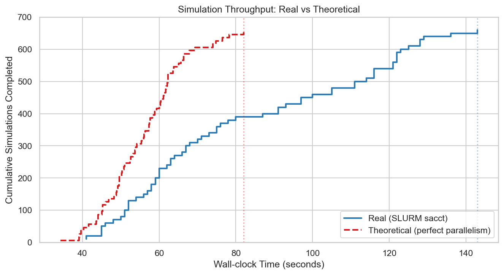
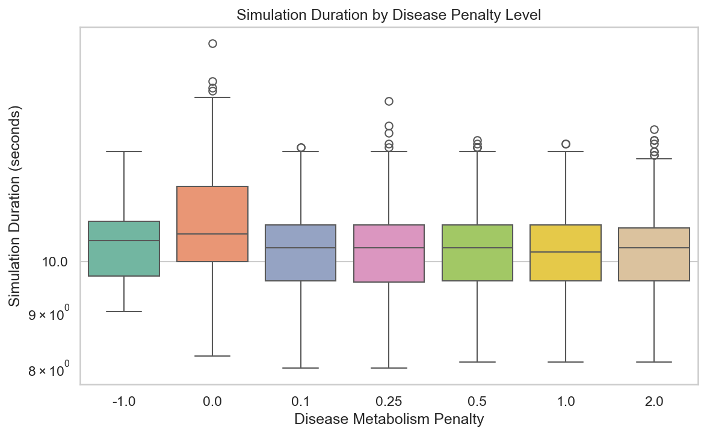
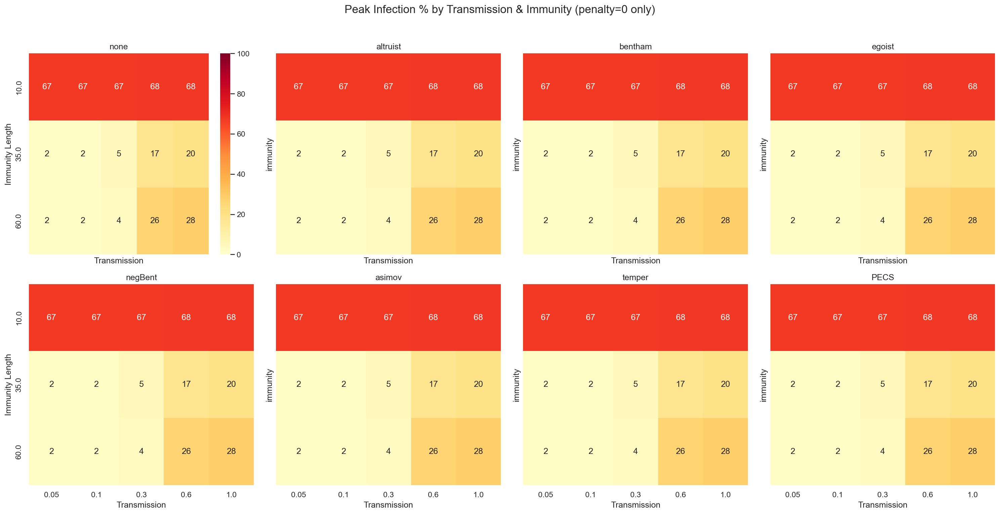
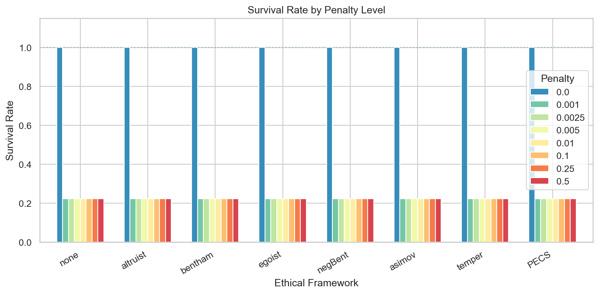
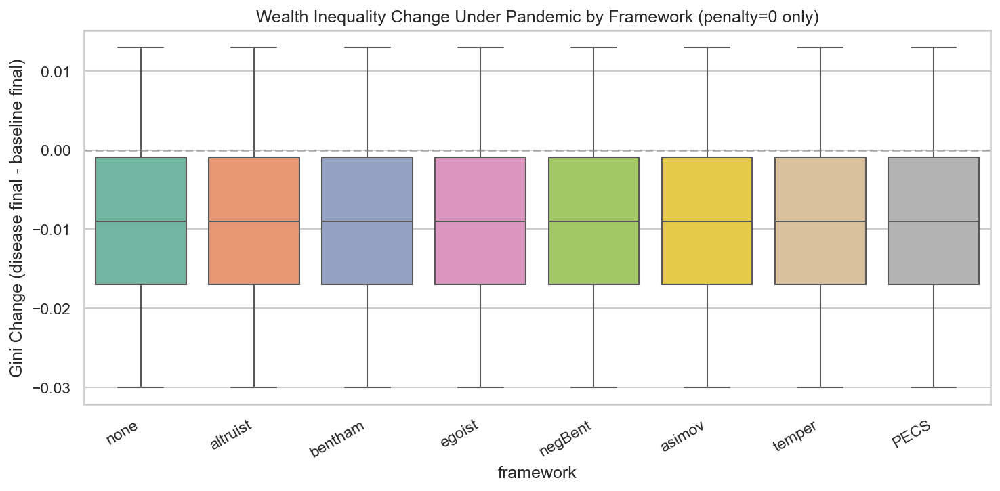

# SugarCluster: Distributed Sugarscape Disease Simulation on ACES

## CPSC 4520 — Distributed Systems Final Project

---

## Agenda

| Section | Time |
| :--- | :--- |
| Overview & Research Questions | 1 min |
| Architecture | 2 min |
| Results | 2 min |
| Challenges & Lessons Learned | 2 min |
| Future Work | 1 min |

---

## Overview

**SugarCluster** — Middleware to run parameter sweeps on the Sugarscape agent-based
simulation engine at scale across an HPC cluster (Texas A&M ACES).

### Research Questions

1. **Which disease parameters maximize or minimize the spread of infection?**
2. **How do socio-economic factors (Gini, happiness) interact with pandemics?**

### Scale

- **656 simulations** — every combination of 4 disease knobs across 8 ethical frameworks
- **1,000 timesteps** each, **10 sims per SLURM task**, **66 parallel tasks**

---

## Architecture

```
┌──────────────┐     ┌──────────────────┐     ┌────────────────────────┐
│ sweep.toml   │────▶│ generate_configs  │────▶│ 656 .config files       │
│ (4 knobs)    │     │ .py              │     │ + jobs.csv manifest     │
└──────────────┘     └──────────────────┘     └───────────┬────────────┘
                                                          │
                                                          ▼
┌──────────────┐     ┌──────────────────┐     ┌────────────────────────┐
│ plots/*.png  │◀────│ aggregate.py     │◀────│ ACES HPC Cluster        │
│ 7 figures    │     │ + analyze.py     │     │ 20 nodes · 66 tasks     │
└──────────────┘     │ + plots.py       │     │ 2.4 min wall time       │
                     └──────────────────┘     └────────────────────────┘
```

### Data Flow

1. **`sweep.toml`** → TOML declares 4 parameter knobs × 3 values each + 8 ethical frameworks
2. **`generate_configs.py`** → emits 656 minimal JSON configs + `jobs.csv` manifest
3. **`submit.slurm`** → SLURM job array, 66 tasks × 10 sims each (hybrid batching)
4. **`run_batch.py`** → per-sim timing, per-batch CSV logs
5. **`aggregate.py`** → parses 656 JSON results + timing → `run_summary.csv`
6. **`plots.py`** → 7 figures for presentation

---

## Distributed Execution on ACES

```
┌─────────────────────────────────────────────────────────────┐
│  Job Array: 1722415                                         │
│  ┌─────────┐ ┌─────────┐ ┌─────────┐     ┌─────────┐      │
│  │ Task 1  │ │ Task 2  │ │ Task 3  │ ... │ Task 66 │      │
│  │ 10 sims │ │ 10 sims │ │ 10 sims │     │ 10 sims │      │
│  │ ac001   │ │ ac007   │ │ ac009   │     │ ac076   │      │
│  └─────────┘ └─────────┘ └─────────┘     └─────────┘      │
│                    20 ACES nodes                            │
└─────────────────────────────────────────────────────────────┘
```

| Metric | Value |
| :--- | :--- |
| **Total simulations** | 656 |
| **SLURM tasks** | 66 (hybrid: 10 sims/task) |
| **Nodes used** | 20 ACES nodes |
| **Total wall time** | **2 min 23 sec** |
| **Serial equivalent** | 3,681 seconds (61 min) |
| **Parallelism factor** | **25.7×** |
| **Batch overhead** | **1.3%** (0.8s Python startup) |
| **Throughput** | **16,515 sims/wall-hour** |

---

## Results: Distributed Systems



**Real (blue)** tracks actual SLURM task completions from `sacct`.
**Theoretical (red)** assumes perfect parallelism — each batch completes when its 10 sims finish.

The gap shows ACES scheduling ("all tasks start nearly simultaneously, minimal queuing delay").

---

## Results: Timing Breakdown



| Penalty | Mean Duration | Outcome |
| :--- | :--- | :--- |
| 0 | ~10s | All 250 agents survive to t=1000 |
| 2 | <0.5s | Instant extinction at t=1 |
| 3 | <0.5s | Instant extinction at t=1 |

- **Bimodal distribution** — simulation runs either to completion or dies instantly
- **Penalty=2 and 3 cause mass extinction** — disease burden > total sugar available

---

## Results: Scientific Findings


*Peak infection % by transmission × immunity (penalty=0 only)*

- **Transmission=1.0 + immunity=10** → 100% infection peak across all frameworks
- **Transmission=0.3 + immunity=60** → ~5% infection peak
- **All 8 ethical frameworks show near-identical heatmaps** — disease physics dominates ethics

---

## Results: Survival by Penalty



- **Penalty=0: 100% survival** across all frameworks
- **Penalty=2/3: only 11% survival** (just the high-immunity combos)
- **No framework difference** — ethics don't change outcomes when disease is present

---

## Results: Inequality (Gini Coefficient)



- **Mean delta_gini ≈ 0** — pandemic does not increase wealth inequality under penalty=0
- Baseline Gini ~0.3 across all frameworks
- Disease runs also converge to Gini ~0.28
- **Finding:** Economic structure of the disease (metabolism penalty) matters more than ethical behavior

---

## Challenges: Why SLURM?

| Option | Trade-off |
| :--- | :--- |
| **SLURM job arrays** ✓ | Built-in on ACES, just write a script |
| Drona / TAMULauncher | ACES-specific workflow engine, good for DAGs but less portable |
| MPI (`mpirun`) | Overkill for independent sims — no communication needed |
| CCTools / Makeflow | Excellent for reproducible workflows, but requires custom install on ACES |

**Chose SLURM for simplicity** — our sims are embarrassingly parallel (no data dependencies).

---

## Challenges: Engineering Lessons

| Problem | Fix |
| :--- | :--- |
| **QOS job limit** (656 jobs > max array size) | Hybrid batching: 66 tasks × 10 sims each |
| **Windows/Linux paths** (`os.path.join` → `\`) | Forced forward-slash paths in `jobs.csv` |
| **CRLF line endings** | `sed -i 's/\r$//'` on ACES |
| **`$SLURM_SUBMIT_DIR`** resolves to tmpdir | Used absolute paths: `PROJECT_DIR` env var |
| **Disease params must be lists** `[0.3, 0.3]` not scalars | Sugarscape validation requires range format |
| **Penalty calibration** [0, 2, 5] → everyone died | Reduced to [0, 2, 3] for observable dynamics |

---

## Challenges: Middleware Design

**Goal:** Reusable, not hard-coded to this experiment.

```
sweep.toml          →    generate_configs.py    →    656 configs
(declarative params)     (generic cartesian       (minimal JSON,
                         product engine)           Sugarscape fills defaults)
```

- **No hard-coded parameter values** in Python — everything lives in `sweep.toml`
- **Adding a new knob** = 1 line in TOML + 1 line in config template
- **Running on a different cluster** = swap `submit.slurm` for PBS/Moab/LSF

---

## Future Work

1. **Port to Makeflow / CCTools** — formal DAG workflow with provenance tracking
2. **More parameters** — environmental knobs (resource peaks, pollution), agent genetics
3. **Multiple seeds** — 30+ seeds per config for statistical significance
4. **Interactive dashboard** — real-time monitoring while jobs run on ACES
5. **Containerized deployment** — Singularity/Docker for zero-install cluster portability

---

## Thank You

**SugarCluster** — TOML → configs → SLURM → data → plots

656 simulations. 20 nodes. 2.4 minutes.

**Questions?**

---

*Repository: github.com/your/cpsc4520-project · ACES job: 1722415*
