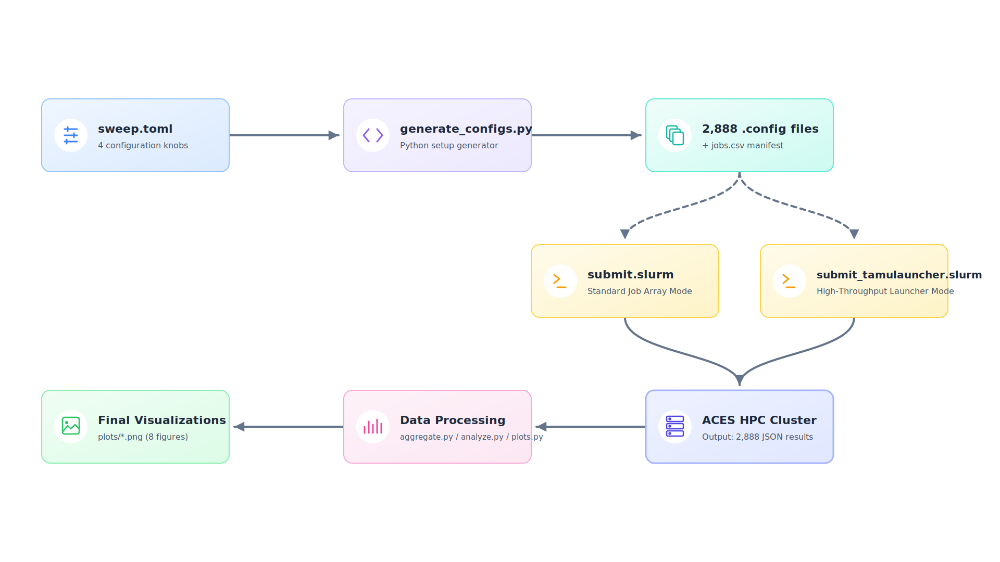
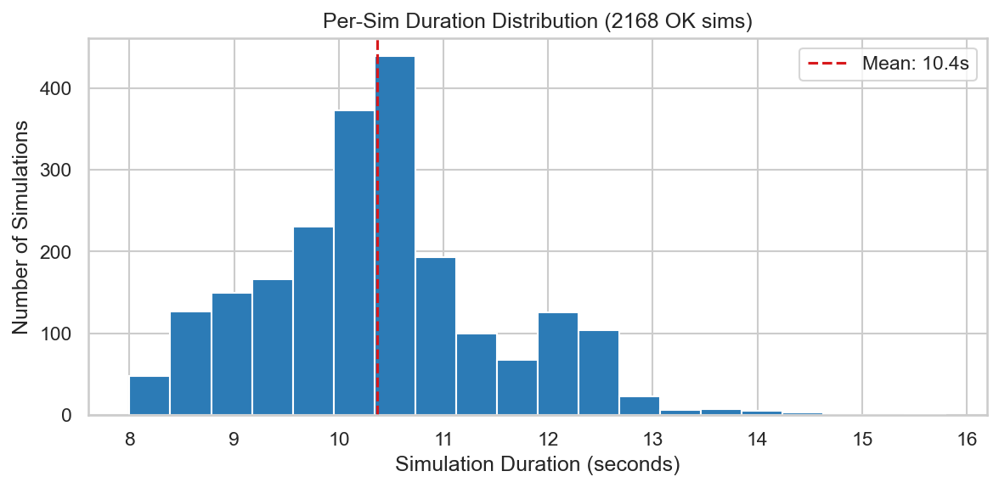
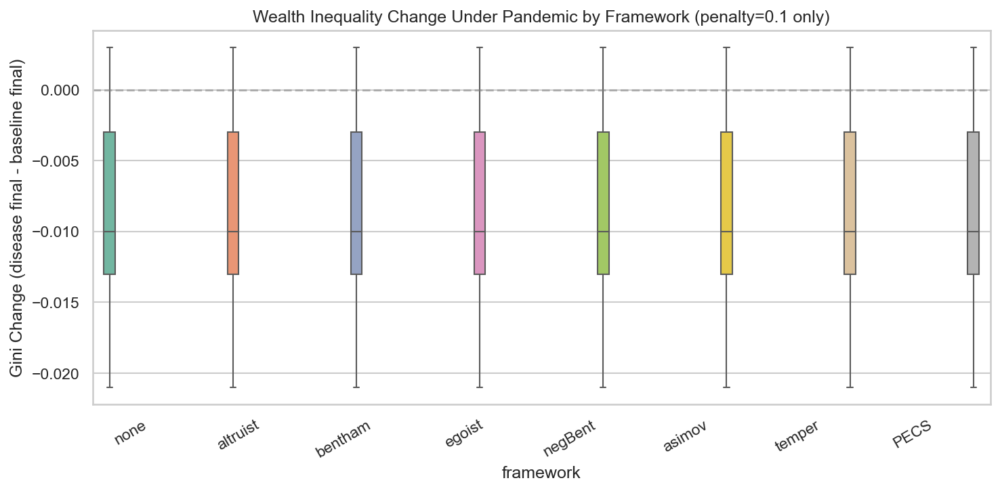

# SugarCluster: Distributed Sugarscape Disease Simulation on ACES

## CPSC 4520 — Distributed Systems Final Project

---

## Agenda

| Section | Time |
| :--- | :--- |
| Overview & Research Questions | 1 min |
| Architecture | 2 min |
| Results | 2 min |
| Challenges & Lessons Learned | 2 min |
| Future Work | 1 min |

---

## Overview

**SugarCluster** — Middleware to run parameter sweeps on the Sugarscape agent-based
simulation engine at scale across an HPC cluster (Texas A&M ACES).

### Research Questions

1. **Which disease parameters maximize or minimize the spread of infection?**
2. **How do ethical frameworks influence socio-economic factors (Gini, happiness) during a pandemic?**

### Scale

- **2,888 simulations** — every combination of 4 disease knobs across 8 ethical frameworks (with baselines)
- **1,000 timesteps** each — run twice: once with SLURM job arrays, once with TAMULauncher

---

## Architecture



### Data Flow

1. **`sweep.toml`** → TOML declares 4 parameter knobs (transmission: 5 values, tag length: 3, immunity: 3, penalty: 8) + 8 ethical frameworks
2. **`generate_configs.py`** → emits 2,888 minimal JSON configs + `jobs.csv` manifest
3. **Two submission strategies** — compared head-to-head (see next slides)
4. **`aggregate.py`** → parses 2,888 JSON results + timing → `run_summary.csv`
5. **`plots.py`** → 8 figures for presentation

---

## Approach 1: SLURM Job Array

```
┌─────────────────────────────────────────────────────────────┐
│  Job Array: 1737370                                         │
│  ┌─────────┐ ┌─────────┐ ┌─────────┐     ┌─────────┐        │
│  │ Task 1  │ │ Task 2  │ │ Task 3  │ ... │ Task 73 │        │
│  │ 40 sims │ │ 40 sims │ │ 40 sims │     │  8 sims │        │
│  │ ac033   │ │ ac107   │ │ ac105   │     │ ac053   │        │
│  └─────────┘ └─────────┘ └─────────┘     └─────────┘        │
│                    12 ACES nodes                            │
└─────────────────────────────────────────────────────────────┘
```

| Metric | Value |
| :--- | :--- |
| **Total simulations** | 2,888 |
| **SLURM tasks** | 80 (hybrid: 40 sims/task) |
| **Nodes used** | 12 ACES nodes |
| **Total wall time** | **6 min 22 sec** (submit → last task) |
| **Serial equivalent** | 8,617 seconds (143.6 min) |
| **Parallelism factor** | **22.5×** |
| **Avg sim duration** | **3.0s** |
| **Throughput** | **27,163 sims/wall-hour** |

**Bottleneck:** ACES QOS limits — max array size forced hybrid batching (40 sims/task).
Global concurrency cap of 40 running jobs limits true parallelism.

---

## Approach 2: TAMULauncher

```
┌──────────────────────────────────────────────────────┐
│  TAMULauncher (Job: 1737571)                         │
│  commands.txt: 1 line per sim                        │
│  ┌──────┐ ┌──────┐ ┌──────┐ ┌──────┐  ...  ┌──────┐  │
│  │ sim1 │ │ sim2 │ │ sim3 │ │ sim4 │       │s2888 │  │
│  └──────┘ └──────┘ └──────┘ └──────┘       └──────┘  │
│          20 nodes × 8 tasks = 160 concurrent         │
└──────────────────────────────────────────────────────┘
```

| Metric | Value |
| :--- | :--- |
| **Total simulations** | 2,888 |
| **Concurrency** | 160 (20 nodes × 8/node) |
| **Total wall time** | **3 min 33 sec** (submit → last sim) |
| **Serial equivalent** | 9,313 seconds (155.2 min) |
| **Parallelism factor** | **43.7×** |
| **Avg sim duration** | **3.2s** |
| **Throughput** | **48,801 sims/wall-hour** |

**No job array limit** — TAMULauncher dispatches all 2,888 as individual tasks automatically.

---

## SLURM vs TAMULauncher: Head-to-Head

| | SLURM Job Array | TAMULauncher |
| :--- | :--- | :--- |
| **Wall time** | 6 min 22 sec | **3 min 33 sec** |
| **Throughput** | 27,163 sims/hr | **48,801 sims/hr** |
| **Parallelism** | 22.5× | **43.7×** |
| **Job limit workaround** | Hybrid batching (complex) | None needed |
| **Overhead** | Batch startup per task | ~0% |
| **Queue wait** | Near-instant (small jobs) | Near-instant (after reduced machine size) |
| **Portability** | Any SLURM cluster | ACES-specific |
| **Observability** | `sacct` per task | Per-sim timing JSON |

**Takeaway:** TAMULauncher is **1.8× faster** in wall time and handles the array size limit
transparently — but requesting 64 CPUs means a longer queue wait even during night time.

---

## Results: Distributed Systems


**TAMULauncher (green)** — 2,888 individual sims, per-sim end timestamps. Finishes at **3:33**.
**SLURM Job Array (blue)** — 80 batch tasks via `sacct`. Staircase reflects 40-sim batches. Finishes at **6:22**.

---

## Results: Timing Breakdown

 

| Penalty | Mean Duration | Outcome |
| :--- | :--- | :--- |
| 0.0 | ~17s | 100% survival to t=1000 |
| 0.001 – 0.5 | ~2.5s | 22.2% survival; 77.8% extinction |

- **Bimodal distribution** — simulation runs either to completion or dies within a few timesteps
- **Even tiny penalties (0.001) cause mass extinction** for 77.8% of configurations
- Survivors are high-immunity / short-tag combinations regardless of penalty magnitude

---

## Results: Scientific Findings


*Peak infection % by transmission × immunity (penalty=0 only)*

- **Transmission=1.0 + immunity=10** → 100% infection peak across all frameworks
- **Transmission=0.05 + immunity=60** → lowest infection spread in the sweep
- **All 8 ethical frameworks show identical heatmaps** — disease physics dominates ethics

---

## Results: Survival by Penalty


- **Penalty=0: 100% survival** across all frameworks
- **Penalty=0.001 – 0.5: only 22.2% survival** (just the high-immunity/short-tag combinations)
- **No framework difference** — ethics don't change outcomes when disease is present

---

## Results: Inequality (Gini Coefficient)



- **Mean delta_gini ≈ −0.034** — wealth inequality decreases under penalty=0.001 (survivors only)
- Baseline Gini ~0.3 across all frameworks
- Disease runs converge to Gini ~0.266
- **Finding:** Economic structure of the disease (metabolism penalty) matters more than ethical behavior

---

## Challenges: Engineering Lessons

| Problem | Fix |
| :--- | :--- |
| **QOS job limit** (2,888 jobs > max array size) | Hybrid batching: 73 tasks × 40 sims → then switched to TAMULauncher |
| **ACES global concurrency cap** (80 jobs) | TAMULauncher bypasses this entirely |
| **TAMULauncher queue wait** | Large resource ask (64 CPU) → longer queue time |
| **Misleading Log**| It says process got killed, so I proceed to debug OOM, turns out it's normal TAMULauncher teardown behavior |
| **`$SLURM_SUBMIT_DIR`** resolves to tmpdir | Used absolute paths: `PROJECT_DIR` env var |
| **Windows/Linux paths** (`os.path.join` → `\`) | Forced forward-slash paths in `jobs.csv` |
| **CRLF line endings** | `commands.txt` written with explicit LF newlines |
| **Final Analysis is Slow**| Use `ThreadPoolExecutor` to parallelize parsing sugarscape outputs |


---

## Challenges: Middleware Design

**Goal:** Reusable, not hard-coded to this experiment.

```
sweep.toml          →    generate_configs.py    →    2,888 configs
(declarative params)     (generic cartesian       (minimal JSON,
                         product engine)           Sugarscape fills defaults)

                    →    generate_commands.py   →    commands.txt
                         (TAMULauncher mode)         (1 line per sim)
```

- **No hard-coded parameter values** in Python — everything lives in `sweep.toml`
- **Adding a new knob** = 1 line in TOML + 1 line in config template
- **Swap execution engine** = switch `submit.slurm` ↔ `submit_tamulauncher.slurm`

---

## Future Work

1. **More parameters** — environmental knobs (resource peaks, pollution), agent genetics
2. **Multiple seeds** — 30+ seeds per config for statistical significance; at 49K sims/hr this is now tractable
3. **Interactive dashboard** — real-time monitoring while jobs run on ACES
4. **Containerized deployment** — Singularity/Docker for zero-install cluster portability

---

## Thank You

**SugarCluster** — TOML → configs → SLURM/TAMULauncher → data → plots

2,888 simulations. Two execution engines. SLURM: 6:22. TAMULauncher: 3:33.

**Questions?**

---

*Repository: github.com/roy-y-2023/cpsc4520-project · SLURM job: 1737370 · TAMULauncher job: 1737571*
